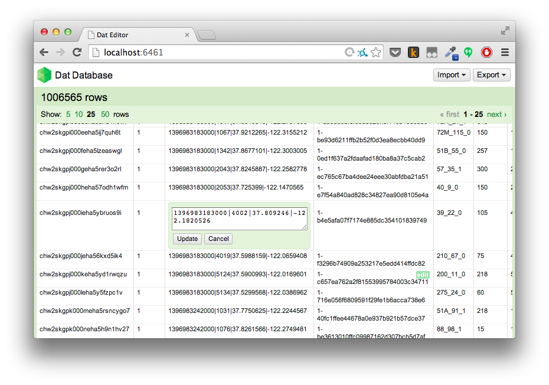

# dat-editor

a front-end application for managing data in dat. comes bundled with dat



## get it running

```
npm install
npm start
open http://localhost:9966?remote=http://mydat.com
```

some CSS comes from the OpenRefine project (https://github.com/OpenRefine/OpenRefine/blob/master/LICENSE.txt)

## prebuilt

there is a prebuilt copy of the app included as `prebuilt.html`. All resources are bundled inside `prebuilt.html` using http://npmjs.org/packify
